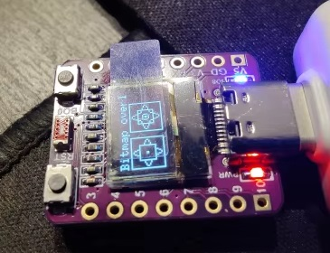
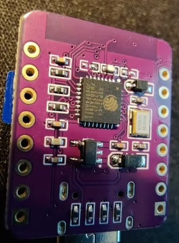

# ESP32-C3-0.42OLED

Hi, this is a fork of the original example for the ESP-C3 version without the RGB diode.

My changes:
* use `U8G2_SH1106_72X40_WISE_F_HW_I2C u8g2(U8G2_R0, U8X8_PIN_NONE, 6, 5);` for initialize **u8g2**,
* comment out `ws2812fx` because this model don't have RGB led,
* add buildin led blinking,
* add WiFi and OTA,
* setup printing on serial port,

Below is the original README:

# ESP32-S3-0.42OLED

# driver

https://zadig.akeo.ie/

# General Flashing Instructions:

Install driver with zadig as mentioned above.
Install Arduino IDE and install espressif resources by adding line "https://raw.githubusercontent.com/espressif/arduino-esp32/gh-pages/package_esp32_dev_index.json" to Additional Boards Manager URLs in Arduino IDE Files / Preferences.
Via Arduino IDE Tools/Board / Board Manager search for ESP32 and choose Espressif Systems version 2.0.3 to install it.
# The following Arduino libraries need to be installed（via option tools / Manage Libraries in Arduino IDE）
u8g2

Setup connection to connect to Board ESP32S3 Dev and com port which is assocuiated to USB Serial Device.

# Upload sketch from Arduino IDE:

Hold down B button on board, press R button and release again but keep on pressing B, trigger Arduino IDE to upload sketch, keep B pressed until Arduino IDE says that it's connected. Then you can release B button.

# Open Source / Contributors

Larry Bank (SCD41_CO2_sensor_demo),

And many many others who haven't been mentioned....

# Community

We have both a Discord Server 
https://discord.gg/qMDNZbX9rE

# Contact 01Space
facebook:Jiale Xu

twitter:yongxiangxu251

E-mail：759315223@qq.com

